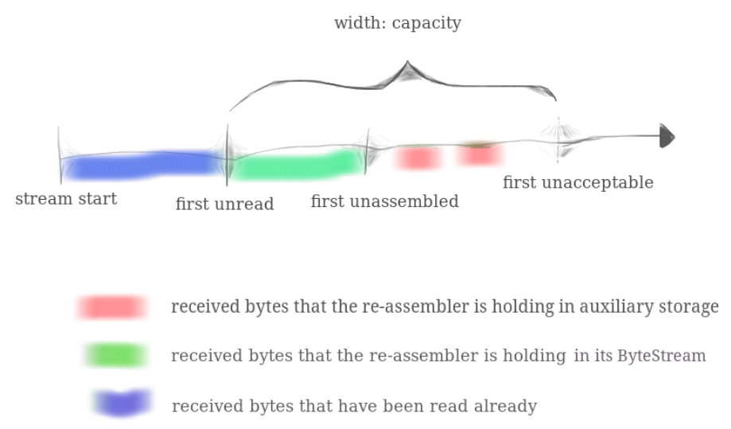
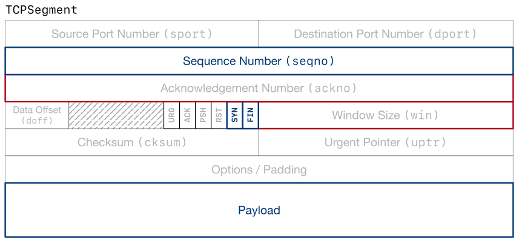
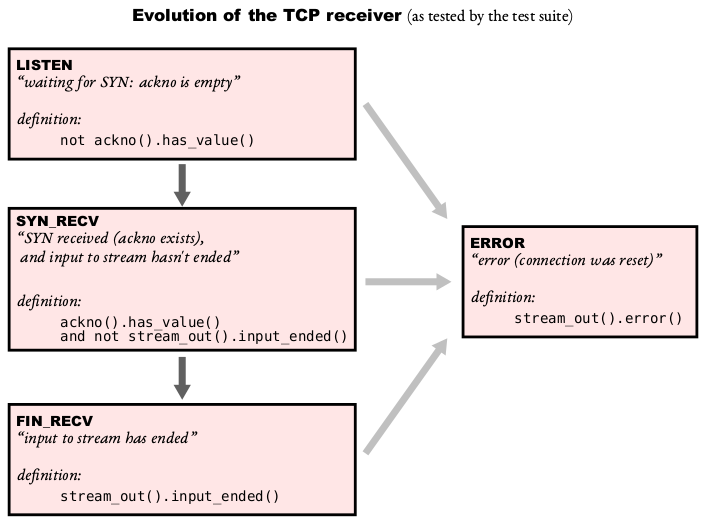
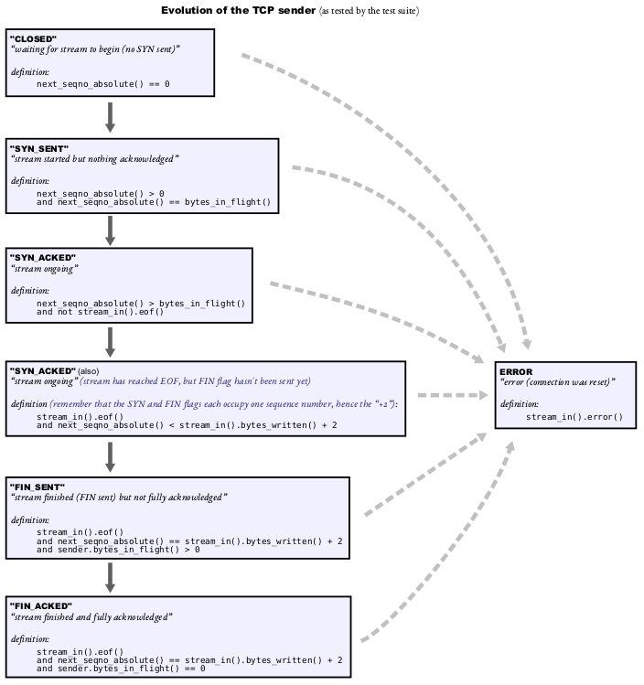
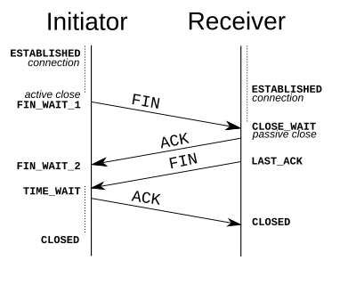

# CS144 Notes

## About

CS144 lab helps us to build our own TCP/IP network stack in user space.

* Course homepage: https://cs144.github.io
* Official codebase: https://github.com/CS144/sponge
* My implementation: https://github.com/li-plus/cs144

## Lab 0: ByteStream

Target: implement a simple in-memory byte stream.

* Ordered read & write
* Limited buffer capacity

Solution: maintain a FIFO of bytes.

* Most straightforward way is to implement the FIFO using `deque`.
* Given the capacity of FIFO, `circular_buffer` may be a better solution since it reduces the memory allocation on IO.

```cpp
/* byte_stream.hh */

class ByteStream {
    // ...
    std::deque<char> _buffer{};
};
```

```cpp
/* byte_stream.cc */

size_t ByteStream::write(const string &data) {
    size_t cnt = std::min(remaining_capacity(), data.size());
    _buffer.insert(_buffer.end(), data.begin(), data.begin() + cnt);
    _bytes_written += cnt;
    return cnt;
}

string ByteStream::peek_output(const size_t len) const { return std::string(_buffer.begin(), _buffer.begin() + len); }

void ByteStream::pop_output(const size_t len) {
    _buffer.erase(_buffer.begin(), _buffer.begin() + len);
    _bytes_read += len;
}

std::string ByteStream::read(const size_t len) {
    std::string output = peek_output(len);
    pop_output(len);
    return output;
}
```

Implement webget using `TCPSocket`:

```cpp
/* webget.cc */

void get_URL(const string &host, const string &path) {
    cerr << "Function called: get_URL(" << host << ", " << path << ").\n";

    TCPSocket sock;
    sock.connect(Address(host, "http"));

    std::ostringstream oss;
    oss << "GET " << path << " HTTP/1.1\r\nHost: " << host << "\r\nConnection: close\r\n\r\n";
    sock.write(oss.str());

    while (!sock.eof()) {
        std::cout << sock.read();
    }
}
```

## Lab 1: StreamReassembler

Target: implement a stream reassembler to organize unordered string pieces into an ordered stream. The reassembler will later serve as the sliding window of TCP Receiver.

* Each string is pushed into the reassembler along with its starting index in the stream, as well as the EOF flag (whether the entire stream ends with this string piece).
* The reassembler handles the window between the first-unread and first-unacceptable, while the byte stream holds the bytes between stream-start and first-unread. The total size of bytes in byte stream plus reassembler window should not exceed the given capacity.
* Once any bytes are assembled in the reassembler window (green part), the reassembler immediately writes the assembled bytes into the byte stream. Once any bytes are read and popped from the byte stream, the reassembler window moves forward and is ready to accept more bytes.
* The reassembler should end the input of byte stream only after it writes the last byte of the stream into the byte stream.



Solution: maintain a sliding window.

* Maintain a FIFO (`deque`) of bytes and a FIFO of boolean flags. Each byte has a flag indicating whether this byte is occupied.
* Likewise, `circular_buffer` is an option to reduce memory allocation.

```cpp
/* stream_reassembler.hh */

class StreamReassembler {
    ByteStream _output;  //!< The reassembled in-order byte stream
    size_t _capacity;    //!< The maximum number of bytes
    uint64_t _start_idx;
    uint64_t _eof_idx;
    std::deque<char> _buffer;
    std::deque<bool> _bitmap;
};
```

```cpp
/* stream_reassembler.cc */

void StreamReassembler::push_substring(const string &data, const size_t index, const bool eof) {
    if (eof) {
        _eof_idx = index + data.size();
    }

    uint64_t min_idx = std::max(index, _start_idx);
    uint64_t max_idx = std::min(index + data.size(), _start_idx + _output.remaining_capacity());
    if (min_idx < max_idx) {
        // read data into buffer
        std::copy(data.begin() + (min_idx - index),
                  data.begin() + (max_idx - index),
                  _buffer.begin() + (min_idx - _start_idx));
        std::fill_n(_bitmap.begin() + (min_idx - _start_idx), max_idx - min_idx, true);

        // write assembled bytes into output
        auto write_size = std::find(_bitmap.begin(), _bitmap.end(), false) - _bitmap.begin();
        std::string out_string(_buffer.begin(), _buffer.begin() + write_size);
        _output.write(out_string);
        _buffer.erase(_buffer.begin(), _buffer.begin() + write_size);
        _buffer.insert(_buffer.end(), write_size, '\0');
        _bitmap.erase(_bitmap.begin(), _bitmap.begin() + write_size);
        _bitmap.insert(_bitmap.end(), write_size, false);
        _start_idx += write_size;
    }

    if (_start_idx == _eof_idx) {
        _output.end_input();
    }
}
```

## Lab 2: TCP Receiver

Target: implement the "receiver" part of TCP, responsible for receiving TCP segments (the actual datagram payloads), reassembling the byte stream (including its ending, when that occurs), and determining that signals that should be sent back to the sender for acknowledgment and flow control.

* TCP receiver receives bytes from the remote peer and send acknoledgement back.
* Each individual **byte** has a 32-bit sequence number indicating its stream index. The first sequence number in the stream is a random 32-bit number called the Initial Sequence Number (ISN). The SYN and FIN control flags each occupy 1 sequence number.
* The index of the "first unassembled" byte, which is called the "acknowledgment number" or "ackno." This is the first byte that the receiver needs from the sender.
* The distance between the "first unassembled" index and the "first unacceptable" index. This is called the "window size".



Solution: maintain a state machine.

* Start receiving payload only after SYN flag is received.
* Once it receives a TCP segment, convert the 32-bit seqno to 64-bit absolute seqno (stream index), and push the payload into the reassembler.
* If FIN is received, push eof flag into the reassembler.



```cpp
/* wrapping_integers.cc */

WrappingInt32 wrap(uint64_t n, WrappingInt32 isn) { return WrappingInt32((n + isn.raw_value()) & 0xffffffff); }

uint64_t unwrap(WrappingInt32 n, WrappingInt32 isn, uint64_t checkpoint) {
    int32_t offset = n - wrap(checkpoint, isn);
    int64_t abs_seqno = offset + checkpoint;
    if (abs_seqno < 0) {
        abs_seqno += 1ull << 32;
    }
    return abs_seqno;
}
```

```cpp
/* tcp_receiver.hh */

class TCPReceiver {
    // ...
    bool _syn_recv;
    WrappingInt32 _isn;
};
```

```cpp
/* tcp_receiver.cc */

void TCPReceiver::segment_received(const TCPSegment &seg) {
    if (!_syn_recv) {  // CLOSED
        if (seg.header().syn) {
            _syn_recv = true;
            _isn = seg.header().seqno;
            _reassembler.push_substring(seg.payload().copy(), 0, seg.header().fin);
        }
    } else if (!stream_out().input_ended()) {  // SYN_RECV
        uint64_t index = unwrap(seg.header().seqno, _isn, _reassembler.first_unassembled()) - 1;
        _reassembler.push_substring(seg.payload().copy(), index, seg.header().fin);
    } else {  // FIN_RECV
        // ignore
    }
}

optional<WrappingInt32> TCPReceiver::ackno() const {
    if (!_syn_recv) {  // CLOSED
        return {};
    } else if (!stream_out().input_ended()) {  // SYN_RECV
        return wrap(_reassembler.first_unassembled() + 1, _isn);
    } else {  // FIN_RECV
        return wrap(_reassembler.first_unassembled() + 2, _isn);
    }
}

size_t TCPReceiver::window_size() const { return _reassembler.first_unacceptable() - _reassembler.first_unassembled(); }
```

## Lab 3: TCP Sender

Target: implement the "sender" part of TCP, responsible for reading from a ByteStream (created and written to by some sender-side application), and turning the stream into a sequence of outgoing TCP segments.

* Keep track of the receiver's window (processing incoming acknos and window sizes)
* Fill the window when possible, by reading from the ByteStream, creating new TCP segments (including SYN and FIN flags if needed), and sending them. The sender should keep sending segments until either the window is full or the ByteStream is empty.
* Keep track of which segments have been sent but not yet acknowledged by the receiver - we call these "outstanding" segments
* Re-send outstanding segments if enough time passes since they were sent, and they haven't been acknowledged yet

Interface:

* Sending segments by `fill_window`
  * reads from its input ByteStream and sends as many bytes as possible in the form of TCPSegments, as long as there are new bytes to be read and space available in the window.
  * Remember that the SYN and FIN flags also occupy a sequence number each, which means that they occupy space in the window.
  * If the receiver has announced a window size of zero, the fill window method should act like the window size is one.
* Receiving ack by `ack_received`
  * A segment is received from the receiver, conveying the new left (= ackno) and right (= ackno + window size) edges of the window.
  * The TCPSender should look through its collection of outstanding segments and remove any that have now been fully acknowledged (the ackno is greater than all of the sequence numbers in the segment).
  * The TCPSender should fill the window again if new space has opened up.

Retransmission timer:

* The retransmission timeout (RTO) is the number of milliseconds to wait before resending an outstanding TCP segment.
* If tick is called and the retransmission timer has expired:
  * Retransmit the earliest (lowest sequence number) segment that hasn't been fully acknowledged by the TCP receiver.
  * If the window size is nonzero:
    * Keep track of the number of consecutive retransmissions, and increment it because you just retransmitted something.
    * Double the value of RTO. This is called "exponential backoff" - it slows down retransmissions on lousy networks to avoid further gumming up the works.
  * Reset the retransmission timer and start it such that it expires after RTO milliseconds (taking into account that you may have just doubled the value of RTO!).
* When the receiver gives the sender an ackno that acknowledges the successful receipt of new data (the ackno reflects an absolute sequence number bigger than any previous ackno):
  * Set the RTO back to its "initial value."
  * If the sender has any outstanding data, restart the retransmission timer so that it will expire after RTO milliseconds (for the current value of RTO).
  * Reset the count of "consecutive retransmissions" back to zero.



```cpp
/* tcp_sender.hh */

class TCPTimer {
  private:
    size_t _timeout;
    size_t _elapsed;

  public:
    TCPTimer(size_t timeout) : _timeout(timeout), _elapsed(0) {}

    size_t timeout() const { return _timeout; }
    void set_timeout(size_t timeout) { _timeout = timeout; }

    void reset() { _elapsed = 0; }

    void tick(size_t time_since_last_tick) { _elapsed += time_since_last_tick; }

    bool is_timeout() const { return _elapsed >= _timeout; }
};
```

```cpp
/* tcp_sender.cc */

void TCPSender::fill_window() {
    auto send_non_empty_segment = [this](const TCPSegment &seg) {
        _segments_out.push(seg);
        _outstanding_segments.push_back(seg);
        _next_seqno += seg.length_in_sequence_space();
    };
    size_t window_size = std::max(_window_size, size_t(1));
    if (_next_seqno == 0) {
        // CLOSED
        TCPSegment seg;
        seg.header().syn = true;
        seg.header().seqno = next_seqno();
        send_non_empty_segment(seg);
    } else if (_next_seqno == bytes_in_flight()) {
        // SYN_SENT
    } else if (!stream_in().eof()) {
        // SYN_ACKED
        size_t avail_size = window_size - (_next_seqno - _ackno);
        while (avail_size > 0 && !_stream.buffer_empty()) {
            size_t payload_size = std::min({_stream.buffer_size(), avail_size, TCPConfig::MAX_PAYLOAD_SIZE});
            TCPSegment seg;
            seg.header().seqno = next_seqno();
            seg.payload() = _stream.read(payload_size);
            if (_stream.eof() && avail_size > payload_size) {
                seg.header().fin = true;
            }
            send_non_empty_segment(seg);
            avail_size -= seg.length_in_sequence_space();
        }
    } else if (_next_seqno < stream_in().bytes_written() + 2) {
        // SYN_ACKED
        if (window_size > _next_seqno - _ackno) {
            TCPSegment seg;
            seg.header().seqno = next_seqno();
            seg.header().fin = true;
            send_non_empty_segment(seg);
        }
    } else if (bytes_in_flight()) {
        // FIN_SENT
    } else {
        // FIN_ACKED
    }
}

void TCPSender::ack_received(const WrappingInt32 ackno, const uint16_t window_size) {
    uint64_t ackno_abs = unwrap(ackno, _isn, _next_seqno);
    if (_ackno <= ackno_abs && ackno_abs <= _next_seqno) {
        // valid ackno
        if (_ackno < ackno_abs) {
            // new data is acknowledged
            _ackno = ackno_abs;
            auto ack_pos = std::find_if(
                _outstanding_segments.begin(), _outstanding_segments.end(), [this, ackno_abs](const TCPSegment &seg) {
                    uint64_t segno_abs = unwrap(seg.header().seqno, _isn, _next_seqno);
                    return ackno_abs < segno_abs + seg.length_in_sequence_space();
                });
            _outstanding_segments.erase(_outstanding_segments.begin(), ack_pos);

            // reset retransmission metrics
            _timer.reset();
            _timer.set_timeout(_initial_retransmission_timeout);
            _consecutive_retransmissions = 0;
        }
        _window_size = window_size;
        fill_window();
    }
}

void TCPSender::tick(const size_t ms_since_last_tick) {
    _timer.tick(ms_since_last_tick);
    if (_timer.is_timeout()) {
        _timer.reset();
        if (!_outstanding_segments.empty()) {
            _segments_out.push(_outstanding_segments.front());
            if (_window_size > 0) {
                _consecutive_retransmissions++;
                _timer.set_timeout(_timer.timeout() * 2);  // exponential backoff
            }
        }
    }
}
```

## Lab 4: TCP Connection

Here we come to the most challenging part in the entire project.

`TCPConnection` acts as one of the peers. It's responsible for receiving and sending segments, making sure the sender and receiver are informed about and have a chance to contribute to the fields they care about for incoming and outgoing segments.

The task is to implement a [TCP Finite State Machine (FSM)](http://tcpipguide.com/free/t_TCPOperationalOverviewandtheTCPFiniteStateMachineF-2.htm) by combining the TCP sender and receiver.


Connection establishment: 3-way handshake

* Before a client attempts to connect with a server, the server must first bind to and listen at a port to open it up for connections: this is called a passive open. Once the passive open is established, a client may establish a connection by initiating an active open using the three-way (or 3-step) handshake:
  * SYN: The active open is performed by the client sending a SYN to the server. The client sets the segment's sequence number to a random value A.
  * SYN-ACK: In response, the server replies with a SYN-ACK. The acknowledgment number is set to one more than the received sequence number i.e. A+1, and the sequence number that the server chooses for the packet is another random number, B.
  * ACK: Finally, the client sends an ACK back to the server. The sequence number is set to the received acknowledgment value i.e. A+1, and the acknowledgment number is set to one more than the received sequence number i.e. B+1.
* Steps 1 and 2 establish and acknowledge the sequence number for one direction. Steps 2 and 3 establish and acknowledge the sequence number for the other direction. Following the completion of these steps, both the client and server have received acknowledgments and a full-duplex communication is established.

Connection termination: 4-way handshake



There are four prerequisites to having a clean shutdown in its connection with the "remote" peer:

* Prereq #1 The inbound stream has been fully assembled and has ended.
* Prereq #2 The outbound stream has been ended by the local application and fully sent (including the fact that it ended, i.e. a segment with fin) to the remote peer.
* Prereq #3 The outbound stream has been fully acknowledged by the remote peer.
* Prereq #4 The local TCPConnection is confident that the remote peer can satisfy prerequisite #3. That is, the local peer is confident that the remote peer has received the ACK for FIN. There are two alternative ways this can happen:
  * active close: lingering after both streams end. When the local peer receives FIN2 and sends ACK back, it does not know whether this ACK successfully arrives at remote peer. Therefore, the local peer needs to wait for some time to make sure that the remote peer does not retransmit the FIN, which means the ACK is received.
  * passive close: if the remote peer was the first one to end its stream, the local peer could close the connection immediately on receiving the ACK for FIN2. Since the FIN2 segment's ackno acknowledges the FIN1 seqno, if the local peer receives ACK for FIN2, it is sure that the ACK for FIN1 has been received by the remote peer.

```cpp
/* tcp_connection.cc */

void TCPConnection::send_segments() {
    while (!_sender.segments_out().empty()) {
        auto &seg = _sender.segments_out().front();
        if (_receiver.ackno().has_value()) {
            seg.header().ack = true;
            seg.header().ackno = _receiver.ackno().value();
        }
        seg.header().win = _receiver.window_size();
        if (_sender.stream_in().error() && _receiver.stream_out().error()) {
            seg.header().rst = true;
        }
        _segments_out.push(std::move(seg));
        _sender.segments_out().pop();
    }
}

void TCPConnection::reset_connection() {
    _sender.segments_out() = {};
    _sender.stream_in().set_error();
    _receiver.stream_out().set_error();
    _linger_after_streams_finish = false;
    _active = false;
}

void TCPConnection::try_close() {
    // both streams are ended
    if (_receiver.stream_out().input_ended() &&
        (_sender.stream_in().eof() && _sender.next_seqno_absolute() == _sender.stream_in().bytes_written() + 2 &&
         _sender.bytes_in_flight() == 0)) {
        if (!_linger_after_streams_finish || _time_since_last_segment_received >= 10 * _cfg.rt_timeout) {
            _active = false;
        }
    }
}

void TCPConnection::segment_received(const TCPSegment &seg) {
    _time_since_last_segment_received = 0;
    if (seg.header().rst) {
        reset_connection();
    } else {
        _receiver.segment_received(seg);
        if (_receiver.stream_out().input_ended() && !_sender.stream_in().eof()) {
            // passive close: received FIN from remote peer before sending FIN
            _linger_after_streams_finish = false;
        }
        if (seg.header().ack) {
            _sender.ack_received(seg.header().ackno, seg.header().win);
        }
        if (seg.length_in_sequence_space() > 0) {
            _sender.fill_window();
            if (_sender.segments_out().empty()) {
                _sender.send_empty_segment();
            }
        } else if (_receiver.ackno().has_value() && seg.header().seqno == _receiver.ackno().value() - 1) {
            // keep alive
            _sender.send_empty_segment();
        }
        send_segments();
        try_close();
    }
}

size_t TCPConnection::write(const string &data) {
    size_t size = _sender.stream_in().write(data);
    _sender.fill_window();
    send_segments();
    return size;
}

void TCPConnection::tick(const size_t ms_since_last_tick) {
    _time_since_last_segment_received += ms_since_last_tick;
    _sender.tick(ms_since_last_tick);
    if (_sender.consecutive_retransmissions() > TCPConfig::MAX_RETX_ATTEMPTS) {
        reset_connection();
        _sender.send_empty_segment();
    }
    send_segments();
    try_close();
}

void TCPConnection::end_input_stream() {
    _sender.stream_in().end_input();
    _sender.fill_window();
    send_segments();
}

void TCPConnection::connect() {
    _sender.fill_window();
    send_segments();
}

TCPConnection::~TCPConnection() {
    try {
        if (active()) {
            cerr << "Warning: Unclean shutdown of TCPConnection\n";

            // Your code here: need to send a RST segment to the peer
            reset_connection();
            _sender.send_empty_segment();
            send_segments();
        }
    } catch (const exception &e) {
        std::cerr << "Exception destructing TCP FSM: " << e.what() << std::endl;
    }
}
```

**Testing Fixture**

TCP-over-UDP:

* Wrap TCP segments in UDP datagram payload, as a tunnel.
* Randomly drop packets on reading & writing by a configurable loss rate, leading to packet retransmission.
* Tested within a subnet: server binds and listens to 169.254.144.1:23455 and client connects to it.
* Use wireshark to capture packets on loopback (lo) interface.

TCP-over-IPv4:

* The `tun.sh` script creates two TUN devices (`tun144`, `tun145`) and their corresponding routes.
* Switch the socket in `webget.cc` to `CS144TCPSocket`, which binds to `tun144` manipulating IP packets.
* Packet capturing on tun144 or tun145.
* Learn more about TUN/TAP devices on [wikipedia](https://en.wikipedia.org/wiki/TUN/TAP) and [linux kernel doc](https://www.kernel.org/doc/Documentation/networking/tuntap.txt).

```
+--------+                       tun144 +----------------+ tun145                       +--------+
| client | <--------------------------> | system routing | <--------------------------> | server |
+--------+ 169.254.144.9  169.254.144.1 +----------------+ 169.254.145.1  169.254.145.9 +--------+
```

```
$ ip addr
5: tun144: <NO-CARRIER,POINTOPOINT,MULTICAST,NOARP,UP> mtu 1500 qdisc fq_codel state DOWN group default qlen 500
    link/none 
    inet 169.254.144.1/24 scope global tun144
       valid_lft forever preferred_lft forever
    inet6 fe80::7e7f:e6d9:b3de:1033/64 scope link stable-privacy 
       valid_lft forever preferred_lft forever
6: tun145: <NO-CARRIER,POINTOPOINT,MULTICAST,NOARP,UP> mtu 1500 qdisc fq_codel state DOWN group default qlen 500
    link/none 
    inet 169.254.145.1/24 scope global tun145
       valid_lft forever preferred_lft forever
    inet6 fe80::4b73:a3ed:832f:2c3c/64 scope link stable-privacy 
       valid_lft forever preferred_lft forever

$ ip route
169.254.144.0/24 dev tun144 scope link linkdown rto_min lock 10ms
169.254.145.0/24 dev tun145 scope link linkdown rto_min lock 10ms
```

**iptables config**

If all TCP-over-UDP tests succeeded while TCP-over-IPv4 tests failed on `make check_lab4`, reasons might be that the firewall disabled ipv4 forwarding. Check iptables policy by:

```sh
sudo iptables -L
```

If you find "Chain FORWARD (policy DROP)", switch it to "ACCEPT":

```sh
sudo iptables -P FORWARD ACCEPT
```

**benchmark**

Got an average performance result without much optimization:

```
$ ./apps/tcp_benchmark 
CPU-limited throughput                : 1.71 Gbit/s
CPU-limited throughput with reordering: 1.65 Gbit/s
```

## Lab 5: Network Interface

Implement an IP-Ethernet stack.

* Sending an IP packet:
  * Look up the MAC address of the next hop in the ARP table. If found, fill up the `dst_mac` in Ethernet header and send the packet. Otherwise, send ARP request to the next hop to get its MAC address, and queue the packets to be sent (in real world may just drop the packet).
* Receiving an Ethernet frame:
  * Check if `dst_mac` is broadcast address, multicast address or my interface mac address.
  * Learn IP-MAC mapping from ARP packets, and memorize the mapping in ARP table.
  * If receiving ARP request for the MAC of my IP, send ARP reply back.
  * Send the packets in queue whose target's MAC address is learned.

```cpp
/* network_interface.hh */

struct ArpEntry {
    uint32_t ip;
    EthernetAddress mac;
    size_t ms_inserted;

    ArpEntry(uint32_t ip_, EthernetAddress mac_, size_t ms_inserted_) : ip(ip_), mac(mac_), ms_inserted(ms_inserted_) {}
};

class ArpTable {
  public:
    static constexpr size_t TTL = 30 * 1000;

    ArpTable() = default;

    size_t size() const { return _list.size(); }
    bool empty() const { return _list.empty(); }

    void push_back(const ArpEntry &entry) {
        if (_map.count(entry.ip) == 0) {
            _list.emplace_back(entry);
            _map.insert(std::make_pair(entry.ip, --_list.end()));
        }
    }

    const ArpEntry &front() const { return _list.front(); }
    void pop_front() {
        _map.erase(_list.front().ip);
        _list.pop_front();
    }

    std::list<ArpEntry>::const_iterator begin() const { return _list.begin(); }
    std::list<ArpEntry>::const_iterator end() const { return _list.end(); }
    std::list<ArpEntry>::const_iterator find(uint32_t ip) const {
        auto map_it = _map.find(ip);
        return (map_it != _map.end()) ? map_it->second : _list.end();
    }

  private:
    std::list<ArpEntry> _list{};
    std::unordered_map<uint32_t, std::list<ArpEntry>::iterator> _map{};
};
```

```cpp
/* network_interface.cc */

constexpr size_t ARP_REQUEST_INTERVAL = 5 * 1000;

static EthernetFrame make_arp_frame(uint16_t opcode,
                                    const EthernetAddress &sender_mac,
                                    uint32_t sender_ip,
                                    const EthernetAddress &target_mac,
                                    uint32_t target_ip) {
    ARPMessage arp_message;
    arp_message.opcode = opcode;
    arp_message.sender_ethernet_address = sender_mac;
    arp_message.sender_ip_address = sender_ip;
    arp_message.target_ethernet_address = (opcode == ARPMessage::OPCODE_REPLY) ? target_mac : EthernetAddress{};
    arp_message.target_ip_address = target_ip;

    EthernetFrame frame;
    frame.header().dst = (opcode == ARPMessage::OPCODE_REPLY) ? target_mac : ETHERNET_BROADCAST;
    frame.header().src = sender_mac;
    frame.header().type = EthernetHeader::TYPE_ARP;
    frame.payload() = arp_message.serialize();

    return frame;
}

static EthernetFrame make_ip_frame(const InternetDatagram &dgram,
                                   const EthernetAddress &dst_mac,
                                   const EthernetAddress &src_mac) {
    EthernetFrame frame;
    frame.header().dst = dst_mac;
    frame.header().src = src_mac;
    frame.header().type = EthernetHeader::TYPE_IPv4;
    frame.payload() = dgram.serialize();
    return frame;
}

void NetworkInterface::send_datagram(const InternetDatagram &dgram, const Address &next_hop) {
    // convert IP address of next hop to raw 32-bit representation (used in ARP header)
    const uint32_t next_hop_ip = next_hop.ipv4_numeric();

    auto arp_entry = _arp_table.find(next_hop_ip);
    if (arp_entry == _arp_table.end()) {
        // mac address not found. need to send arp request
        if (_ms_clock - _ms_last_arp > ARP_REQUEST_INTERVAL) {
            _frames_out.push(make_arp_frame(ARPMessage::OPCODE_REQUEST,
                                            _ethernet_address,
                                            _ip_address.ipv4_numeric(),
                                            EthernetAddress{},
                                            next_hop_ip));
            _ms_last_arp = _ms_clock;
        }
        _pending_dgrams[next_hop_ip].emplace_back(dgram);
    } else {
        auto frame = make_ip_frame(dgram, arp_entry->mac, _ethernet_address);
        _frames_out.push(frame);
    }
}

optional<InternetDatagram> NetworkInterface::recv_frame(const EthernetFrame &frame) {
    if (frame.header().dst != ETHERNET_BROADCAST && frame.header().dst != _ethernet_address) {
        return {};
    }
    if (frame.header().type == EthernetHeader::TYPE_IPv4) {
        InternetDatagram ipv4_datagram;
        ipv4_datagram.parse(frame.payload());
        return ipv4_datagram;
    }
    if (frame.header().type == EthernetHeader::TYPE_ARP) {
        ARPMessage arp_message;
        arp_message.parse(frame.payload());
        // learn arp mapping
        _arp_table.push_back(ArpEntry(arp_message.sender_ip_address, arp_message.sender_ethernet_address, _ms_clock));
        if (arp_message.opcode == ARPMessage::OPCODE_REQUEST &&
            arp_message.target_ip_address == _ip_address.ipv4_numeric()) {
            _frames_out.push(make_arp_frame(ARPMessage::OPCODE_REPLY,
                                            _ethernet_address,
                                            _ip_address.ipv4_numeric(),
                                            arp_message.sender_ethernet_address,
                                            arp_message.sender_ip_address));
        }
        auto pending_dgrams_it = _pending_dgrams.find(arp_message.sender_ip_address);
        if (pending_dgrams_it != _pending_dgrams.end()) {
            for (const auto &dgram : pending_dgrams_it->second) {
                _frames_out.push(make_ip_frame(dgram, arp_message.sender_ethernet_address, _ethernet_address));
            }
            _pending_dgrams.erase(pending_dgrams_it);
        }
    }
    return {};
}

void NetworkInterface::tick(const size_t ms_since_last_tick) {
    _ms_clock += ms_since_last_tick;
    while (!_arp_table.empty() && _ms_clock - _arp_table.front().ms_inserted > ArpTable::TTL) {
        _arp_table.pop_front();
    }
}
```

**Testing**

* Switch the socket in `webget.cc` to `FullStackSocket`, and run `make check_lab5`.
* Before testing, the `tap.sh` script creates a TAP device (`tap10`) with virtual ethernet and ip address.
* The `FullStackSocket` binds to `tap10`, sending and receiving ethernet packets routed by linux kernel.

```
$ ip addr
7: tap10: <NO-CARRIER,BROADCAST,MULTICAST,UP> mtu 1500 qdisc fq_codel state DOWN group default qlen 1000
    link/ether 02:b0:1d:fa:ce:0a brd ff:ff:ff:ff:ff:ff
    inet 169.254.10.1/24 scope global tap10
       valid_lft forever preferred_lft forever
    inet6 fe80::b0:1dff:fefa:ce0a/64 scope link 
       valid_lft forever preferred_lft forever

$ ip route
169.254.10.0/24 dev tap10 scope link linkdown rto_min lock 10ms 
```

## Lab 6: IP Router

Implement a simple IP Router.

* Find the next hop for destination IP in the route table by longest prefix match (LPM).
* If directly connected, send the packet to destination IP address. Otherwise, send it to the next hop. Decrease TTL by 1 on forwarding.
* Follow the static routes to forward the packet. No need to implement routing protocols for information exchange between routers.

```cpp
/* router.hh */

struct RouteEntry {
    uint32_t route_prefix;
    uint8_t prefix_length;
    uint32_t next_hop_ip;
    size_t interface_num;

    RouteEntry(uint32_t route_prefix_, uint8_t prefix_length_, uint32_t next_hop_ip_, size_t interface_num_)
        : route_prefix(route_prefix_)
        , prefix_length(prefix_length_)
        , next_hop_ip(next_hop_ip_)
        , interface_num(interface_num_) {}
};

class Router {
    // ...
    std::vector<RouteEntry> _route_table{};
};
```

```cpp
/* router.cc */

void Router::add_route(const uint32_t route_prefix,
                       const uint8_t prefix_length,
                       const optional<Address> next_hop,
                       const size_t interface_num) {
    cerr << "DEBUG: adding route " << Address::from_ipv4_numeric(route_prefix).ip() << "/" << int(prefix_length)
         << " => " << (next_hop.has_value() ? next_hop->ip() : "(direct)") << " on interface " << interface_num << "\n";

    uint32_t next_hop_ip = next_hop.has_value() ? next_hop->ipv4_numeric() : 0;
    _route_table.emplace_back(RouteEntry(route_prefix, prefix_length, next_hop_ip, interface_num));
}

void Router::route_one_datagram(InternetDatagram &dgram) {
    const RouteEntry *lpm_route = nullptr;  // longest-prefix-match
    for (const auto &route : _route_table) {
        uint32_t mask = std::numeric_limits<uint64_t>::max() << (32 - route.prefix_length);
        if ((dgram.header().dst & mask) == route.route_prefix) {
            if (!lpm_route || lpm_route->prefix_length < route.prefix_length) {
                lpm_route = &route;
            }
        }
    }
    if (lpm_route) {
        if (dgram.header().ttl > 1) {
            dgram.header().ttl--;
            uint32_t next_hop_ip = (lpm_route->next_hop_ip == 0) ? dgram.header().dst : lpm_route->next_hop_ip;
            interface(lpm_route->interface_num).send_datagram(dgram, Address::from_ipv4_numeric(next_hop_ip));
        } else {
            // ttl expired, may send ICMP time exceeded?
        }
    } else {
        // no route to host, may send ICMP destination unreachable?
    }
}
```
